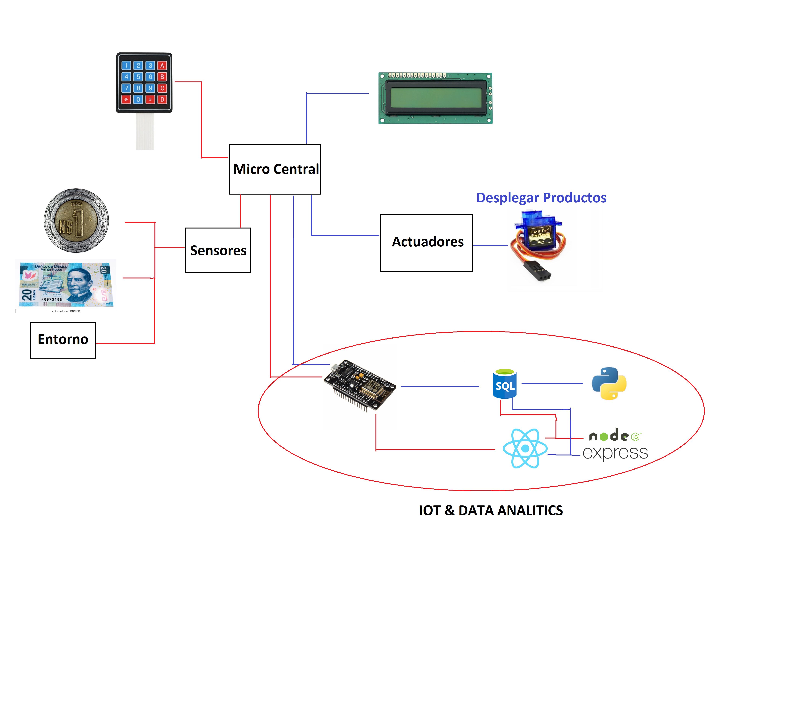

# VendingMachine (Sistema Ciberfisico)

Proyecto de Ingeniería 4 semestre que incorpora sistemas embebidos,, IOT, y desarollo web.  
Desarolladores:  
Luis Felipe Sanchez  
Ana Karen Garcia  
Arturo Sosa  
Alan Alfredo  
Luis Dario  

# Estructura General del proyecto:

